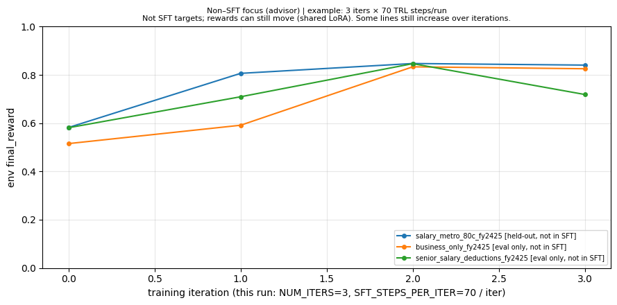

# IndiaTaxBench: teaching models to *advise* on tax—not just to quote the tax code

The most exciting signal in this project is when **two curves move together**: the **training loss steadily collapses toward ~0**, *and at the same time* the **test-set (non–SFT) environment rewards climb** on held-out / eval-only tasks. That combination is strong evidence that we are not just making the model “sound fluent” — we are making it **more useful**, in a way the environment can measure.

## 1. The problem: why the **advisor** track is the exciting part

Most “AI + tax” demos stop at a quick answer: total tax (maybe a simple breakdown), done. That is useful—but it is not how real filers use help. What people actually need is **actionable, next-year guidance**: how to use 80C room, HRA evidence, NPS, health cover, capital-gains planning, and compliance steps—**grounded in their scenario** and written so a human can act on it.

The **advisor** mode in IndiaTaxBench is built for exactly that. The model must emit **structured JSON** (profile summary, concrete next-year actions, cautions) and the **environment** scores that output with a **rubric** tied to the task—so we are not rewarding memorized boilerplate, we are rewarding *useful* advice that matches the filer’s mix of salary, business, rent, and deductions. When the base model already looks “fine” in prose, the real problem is: **can we still move a scalar reward in a way that reflects real improvement?** That is the bar we care about for research and for product: **advisor quality that can be trained, measured, and improved.**

**Where the scenarios and oracle data come from.** We generate the JSONL-backed tasks by running [`india_tax_capture/capture_india_tax_dataset.py`](india_tax_capture/capture_india_tax_dataset.py) over a **manifest** of scenario files, using the **`taxcalcindia`** Python package as the reference computation engine. In code, each row is built by (1) constructing **`IncomeTaxCalculator(...)`** with `TaxSettings`, `SalaryIncome`, `BusinessIncome`, `CapitalGainsIncome`, `OtherIncome`, and `Deductions` built from the scenario JSON, and (2) calling **`calculate_tax(is_comparision_needed=…, is_tax_per_slab_needed=…, display_result=False)`** to produce the oracle tax outcome (and optional regime comparison or per-slab detail, depending on those two flags) that lands in the dataset’s `response` field.

---

## 2. Our **OpenEnv** environment: tasks + rewards, built for research

IndiaTaxBench is deployed as an **OpenEnv**-style service: you **reset** into a task, take **steps** (submit, optionally revise, optionally request context, then finalize), and every step returns an **observation + reward**.

### What our tasks look like
Tasks are loaded from `india_tax_capture/data/india_tax_rows.jsonl`. Each row has:
- an **id** (the `task_id`)
- a `request.scenario` dict (the filer’s income/deductions/settings story)
- a `response.tax_liability.old_regime` block produced by the reference calculator, which provides the **oracle** numeric components (`total`, `initial_tax`, `surcharge`, `cess`)

In the env observation, the scenario is shipped as a pretty-printed JSON string:
- `scenario_json`: the scenario payload
- `task_description`: a short instruction string (advisor vs numeric)
- `task_difficulty`: `easy|medium|hard` (curated label; advisor grading is stricter on “hard” tasks)

### Advisor-mode input/output shape (`reset` and `step`)
On reset, you select **advisor mode** and (optionally) a specific task id; the response bundles the scenario, text instructions, and the allowed actions:

```json
{
  "task_id": "salary_metro_80c_fy2425",
  "episode_mode": "advisor",
  "scenario_json": "{ ... }",
  "task_description": "Given this FY 2024–25 (financial_year=2025) old-regime scenario for task `salary_metro_80c_fy2425`, list practical next-year (next FY / next assessment) tax-saving steps a filer can take—compliant, realistic, and tied to this income and deduction mix (e.g. 80C, NPS, HRA, health insurance, record-keeping, business expenses, capital-gains planning).",
  "valid_actions": ["submit_tax_advice", "request_context", "finalize_advice"],
  "steps_remaining": 15,
  "hints_used": 0,
  "reward": 0.01,
  "done": false
}
```

In advisor steps, the main action is `submit_tax_advice` (or `revise_tax_advice`) with `advice_text` set to **one JSON object encoded as a string**, with required keys:
- `filing_profile_summary`: string
- `next_year_actions`: list of objects like `{ "action": "...", "rationale": "...", "indicative_section": "..." }` (section is optional)
- `cautions`: list of strings

### How rewards look (advisor)
Rewards are intentionally **debuggable** and **bounded** (clamped into \([0.01, 0.99]\)).

This is a **long-horizon** task: you can submit, revise, ask for limited hints, and only then finalize. The reward is shaped so that intermediate steps provide training signal, but the terminal score reflects the best work you produced.

- **Per-step shaped reward (dense signal)**:
  - **Submit**: parse the JSON and score it with the advisor rubric; pay immediately
    - `step_reward = rubric * 0.10`
  - **Revise**: only pay for improvement over the prior version you are revising
    - `step_reward = max(0, rubric_new - rubric_old) * 0.10`
  - **Request context**: each hint is a fixed penalty, capped to 3 hints
    - `step_reward = -0.03`

- **Terminal reward on `finalize_advice` (episode objective)**:
  - pick the **best rubric score** among all advice submissions in the episode
  - add an **efficiency bonus** for finishing earlier (fewer steps used)
  - subtract the total hint penalty and (if the episode auto-finalizes at max steps) an auto-finalize penalty

Concretely:
- `best_rubric = max(submitted_advice[].rubric)`
- `efficiency_bonus = 0.05 * (steps_remaining / 15)`
- `hint_penalty = 0.03 * hints_used`
- `auto_finalize_penalty = 0.05` if max steps were reached (else 0)
- `final_reward = clamp(best_rubric + efficiency_bonus - hint_penalty - auto_finalize_penalty, 0.01, 0.99)`

The observation also includes your history for transparency:
- `submitted_advice`: a list of `{rubric, parsed_ok, raw}` entries
- `feedback`: a human-readable string showing the rubric and the reward components (efficiency, hint penalty, auto-penalty)

---

## 3. The training notebook: OpenEnv + reward signal → a trainable policy (today: **SFT**; tomorrow: your favorite RL)

Our notebook [`notebooks/train_qwen_india_tax.ipynb`](notebooks/train_qwen_india_tax.ipynb) shows end-to-end **local** training against the Space: rollouts, **LoRA** + **TRL `SFTTrainer`**, and an **advisor** mode that refreshes data from the env (**best-of-N** style selection per task when configured). We have **not** shipped a full **PPO / policy-gradient** loop in that notebook—**by design**: the point is to prove the **env + reward + task** pipeline first. The same hooks are exactly where a more sophisticated **RL** algorithm would plug in: same tasks, same rewards, richer optimization on top.

**Evidence** is in the final focus plot below: we plot **tasks that were not part of the SFT training set** (held-out and eval-only task ids). You still see **true progress** on those curves because the **shared adapter** generalizes; the graph is a honest check that we are not only “teaching to the test” on a fixed four scenario ids.

**Model for this run (reporting):** **`Qwen/Qwen2.5-3B-Instruct`** with LoRA—enough capacity for structured JSON and tax phrasing, still trainable on a single consumer GPU with the notebook defaults.

### Plot: test-set (non–SFT) focus — held-out + eval-only tasks



*Figure: `notebooks/output.png` — test-set style plot: tasks **not** used as SFT targets (held-out and eval-only relative to the training split). The curve shows whether the **shared** adapter still moves reward out-of-distribution before you scale to heavier RL.*

---

**Bottom line:** IndiaTaxBench’s **advisor** track turns “sounds good” into **measured** improvement. The OpenEnv integration makes that **reproducible**; the notebook shows **SFT + env** working today, with a clear on-ramp to **stronger RL** tomorrow—and a plot that keeps us honest on **out-of-training** tasks.

---

## 4. Run it yourself: advisor `curl` walkthrough (with outputs)

Below are copy-pasteable `curl` calls for a full **advisor** episode. (All responses are JSON; I’m showing the key fields you’ll care about, but the API returns the full `observation` object including `scenario_json`.)

### Reset into advisor mode

```bash
curl -s -X POST http://localhost:8000/reset -H "Content-Type: application/json" \
  -d '{"task": "salary_metro_80c_fy2425", "advisor": true}' | jq .
```

Expected output (shape):

```json
{
  "observation": {
    "episode_mode": "advisor",
    "task_id": "salary_metro_80c_fy2425",
    "task_difficulty": "hard",
    "task_description": "Given this FY 2024–25 (financial_year=2025) old-regime scenario for task `salary_metro_80c_fy2425`, list practical next-year (next FY / next assessment) tax-saving steps a filer can take—compliant, realistic, and tied to this income and deduction mix (e.g. 80C, NPS, HRA, health insurance, record-keeping, business expenses, capital-gains planning).",
    "reward": 0.01,
    "done": false,
    "hints_used": 0,
    "steps_remaining": 15,
    "valid_actions": ["finalize_advice", "request_context", "submit_tax_advice"],
    "feedback": "Propose **next-year (upcoming FY / next assessment) tax-saving steps** ...",
    "submitted_advice": []
  }
}
```

### Submit advice (as JSON string)

```bash
ADVICE_JSON='{
  "filing_profile_summary": "Metro filer: optimize 80C/80CCD, keep HRA proofs, and plan cash flows for next FY.",
  "next_year_actions": [
    {"action": "Max out 80C instruments under the cap", "rationale": "Use EPF/PPF/ELSS etc. within limits", "indicative_section": "80C"},
    {"action": "Consider NPS contribution (80CCD(1B)) if eligible", "rationale": "Additional deduction beyond 80C cap", "indicative_section": "80CCD"},
    {"action": "Organize rent receipts + landlord PAN where required for HRA", "rationale": "Keep evidence ready for payroll/ITR", "indicative_section": "HRA"}
  ],
  "cautions": [
    "Confirm current-year rule changes and employer HRA policy before acting.",
    "Don’t claim deductions without documentary proof."
  ]
}'

curl -s -X POST http://localhost:8000/step -H "Content-Type: application/json" \
  -d "$(jq -n --arg a "$ADVICE_JSON" '{action:{action_type:"submit_tax_advice", advice_text:$a}}')" | jq .
```

Expected output (key fields):

```json
{
  "observation": {
    "reward": 0.07,
    "done": false,
    "feedback": "Submitted advice 1: rubric=0.7000 (structured JSON=yes)",
    "submitted_advice": [
      {"rubric": 0.7, "parsed_ok": true, "raw": "{...}"}
    ],
    "valid_actions": ["finalize_advice", "request_context", "revise_tax_advice", "submit_tax_advice"]
  }
}
```

### (Optional) Revise advice (only improvement is rewarded)

```bash
curl -s -X POST http://localhost:8000/step -H "Content-Type: application/json" \
  -d "$(jq -n --arg a "$ADVICE_JSON" '{action:{action_type:"revise_tax_advice", item_index:0, advice_text:$a}}')" | jq .
```

Expected output (key fields):

```json
{
  "observation": {
    "reward": 0.01,
    "done": false,
    "feedback": "Revised advice 0: rubric 0.7000 → 0.7000 (delta=+0.0000)",
    "submitted_advice": [
      {"rubric": 0.7, "parsed_ok": true, "raw": "{...}"}
    ]
  }
}
```

### (Optional) Request context (hint; penalized)

```bash
curl -s -X POST http://localhost:8000/step -H "Content-Type: application/json" \
  -d '{"action": {"action_type": "request_context"}}' | jq .
```

Expected output (key fields):

```json
{
  "observation": {
    "reward": 0.01,
    "done": false,
    "hints_used": 1,
    "feedback": "Hint (1/3): Under the old regime, taxable salary income often reflects standard deduction ..."
  }
}
```

### Finalize advice (terminal reward with long-horizon components)

```bash
curl -s -X POST http://localhost:8000/step -H "Content-Type: application/json" \
  -d '{"action": {"action_type": "finalize_advice"}}' | jq .
```

Expected output (key fields):

```json
{
  "observation": {
    "done": true,
    "reward": 0.73,
    "feedback": "Best advice rubric=0.7000 (submissions=1) | efficiency_bonus=0.050, hint_penalty=0.000, auto_penalty=0.000",
    "metadata": {
      "final_reward": 0.73,
      "advisor_rubric": 0.7,
      "efficiency_bonus": 0.05,
      "hint_penalty": 0.0,
      "auto_finalize_penalty": 0.0,
      "steps_used": 2,
      "advice_submissions": 1
    }
  }
}
```
